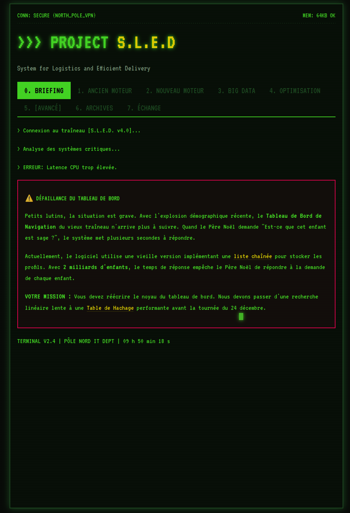

# Project S.L.E.D - Hash Table Practical Work

> **S**ystem for **L**ogistics and **E**fficient **D**elivery

A C programming practical work focused on implementing and optimizing hash tables, presented through a Christmas-themed narrative where students help Santa's elves upgrade the sleigh's navigation system.



## Overview

This educational project guides students through the evolution of data structures, from simple linked lists to optimized hash tables. The scenario: Santa's dashboard can no longer handle 2 billion children with linear search - it's time to upgrade!

## Practical Work Structure

### Phase 1: Legacy Engine (Linked Lists)
- Implement basic `Child` and `HCell` data structures
- Create functions for child management (`createChild`, `displayChild`)
- Build linked list operations (`enqueueChild`, `removeChildList`, `getChildList`, etc.)

### Phase 2: New Engine (Hash Tables)
- Design the `HTable` structure
- Implement basic hash function (naive: based on key length)
- Create hash table operations (`addChild`, `getChildHTable`, `removeChildHash`)

### Phase 3: Big Data Import
- Load large datasets (100,000+ entries)
- Implement statistics display (`displayStats`)
- Analyze collision rates and distribution quality

### Phase 4: Optimization
- Implement improved hash functions:
  - ASCII First Character
  - ASCII Sum
  
### Phase 5: Advanced (Optional)
- DJB2 hashing algorithm
- Dynamic resizing (rehashing) when load factor exceeds 0.75

## Datasets

| File | Description | Size |
|------|-------------|------|
| `dataset_flipou.txt` | Small test dataset | 20 entries |
| `dataset_world.txt` | World population | 100 000 entries |
| `dataset_interplanetary.txt` | Future simulation | 1 000 000 entries |

## Project Structure

```
.
├── index.html              # Practical work instructions (web interface)
├── style.css               # Retro terminal styling
├── script.js               # UI interactions
├── dataset_flipou.txt      # Small test dataset
├── dataset_world.txt       # Large dataset
├── dataset_interplanetary.txt
├── genera_data.py          # Dataset generator
└── insee_data/             # Source data for generation
    ├── patronymes.csv
    └── prenom.csv
```
